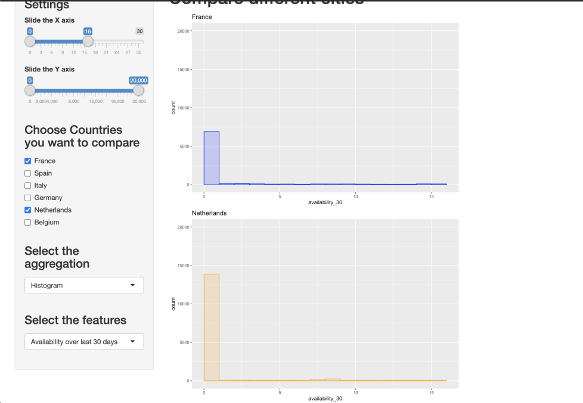
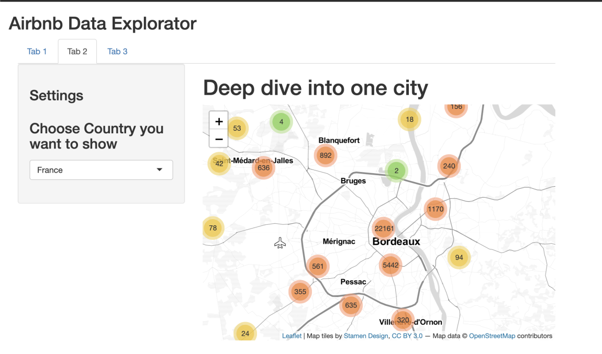
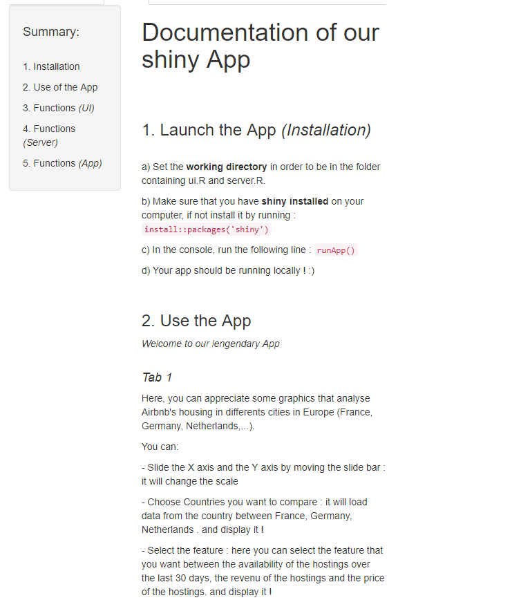

 <h1>Who has never dreamed of being able to analyze AirBnB housing in one clic ? </h1> 

<body style="background-color:white;"></body>

========================================================
author: 
date: 
autosize: true

DALMASSO Olivia - DIREZ Alexis - SEGARD Neil - YE Sebastien
========================================================

 </img> 

========================================================
<h2 style=color:blue> During confinement our group searches a way to analyze housing of our favorites countries </h2>
 

<h3 style=color:red> Do you want to analyze housings of 3 beautiful countries ?  </h3>
 
- Germany
- Netherlands
- France ...

 
<h3  style=color:red> We will focus on : </h3>
 
- The availability of AirBnb's housing over the past 30 days ?  
- Their price ? 
- Or... do you want to spy on owner's income ?  

========================================================
<h1>Shiny</h1>
 
<h2> 
The problematic was to load and to process data in order to display it in a friendly view.
 
For doing that, we use <strong> Shiny </strong>. Shiny is an R package that makes it easy to build interactive web apps straight from R.
It is often use for data vizualisation issues.</h2> 

========================================================
<h1>Possibility of the App</h1>
 
<h2> 
Our apps display some graphs and a map. We click on the country that we want to analyze and the feature that we want.
</h2>
 
<h2>
<strong> Then, the corresponding graph appears !! </strong>
</h2>
 
<h2>
We can also slice the scales of our graphs directly in our app, it can be practical if you want to focus on one point</h2> 

========================================================
<h2 style=color:red>Result 1 - The availability over 30 days in France and Netherlands</h2>
<h4> 
<em> Hope the borders will be open... </em>
</h4>

 </img> 

========================================================
<h2 style=color:red>Result 2 - Watch the map of Bordeaux in France </h2>
<h4> 
<em> A lot of availabilities just next to you... <strong> WOW </strong> </em>
</h4>

 </img> 

========================================================
<h2 style=color:red> Documentation  </h2>
<h4> 
<em> Need some help ? Using our solution is very easy with our documentation ! </em>
</h4>

 </img> 

========================================================
 
 

 <h1> Demonstration </h1> 

========================================================

 
 

 <h1> Thanks for your attention :) </h1> 

